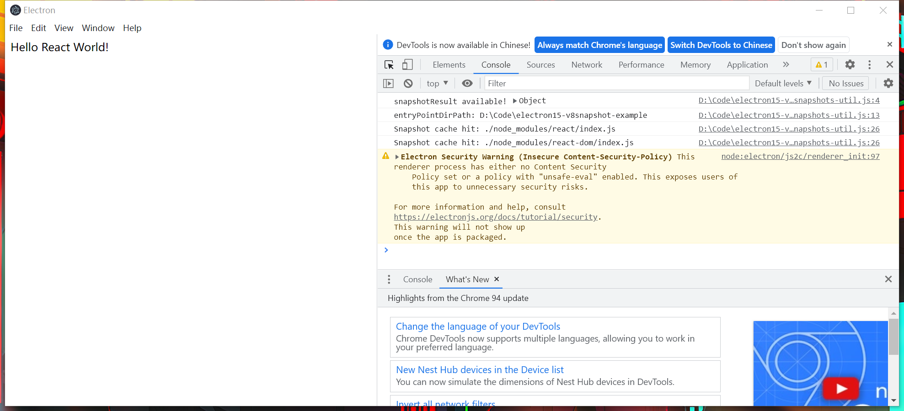

# electron v15.3.0 生成快照的示例

## 1. 安装依赖

```bash
$ npm install
```

## 2. 生成快照

```bash
$ npm run build:snapshot
```

该命令会调用 `src/v8/create-snapshot.js` 。

1. 使用 electron-link 编译需生成快照的模块，由 `src/v8/target.js` 定义

```javascript
// src/v8/create-snapshot.js

require('react');
require('react-dom');
```

2. 由于 electron-mksnapshot 最多只支持 v13.0.0 版本，这里使用优化库 @thlorenz/electron-mksnapshot （可自定义版本号）生成快照，并把结果的快照文件（snapshot_blob.bin、v8_context_snapshot.bin）添加到 electron 的根目录（覆盖原文件）。


## 3. 引入快照模块

主要通过重写 require 方法，通过 require 读取快照模块。

```javascript
// app/v8-snapshots-util.js

const path = require('path');

if (typeof snapshotResult !== 'undefined') {
  console.log('snapshotResult available!', snapshotResult);

  const Module = require('module');
  const entryPointDirPath = path.resolve(global.require.resolve('react'), '..', '..', '..');
  console.log('entryPointDirPath:', entryPointDirPath);

  // 重写 require
  Module.prototype.require = function (module) {
    const absoluteFilePath = Module._resolveFilename(module, this, false);
    let relativeFilePath = path.relative(entryPointDirPath, absoluteFilePath);
    if (!relativeFilePath.startsWith('./')) {
      relativeFilePath = `./${relativeFilePath}`;
    }
    if (process.platform === 'win32') {
      relativeFilePath = relativeFilePath.replace(/\\/g, '/');
    }
    // 默认从快照缓存中获取模块
    let cachedModule = snapshotResult.customRequire.cache[relativeFilePath];
    // 缓存命中
    if (snapshotResult.customRequire.cache[relativeFilePath]) {
      console.log('Snapshot cache hit:', relativeFilePath);
    }
    // 如果缓存模块获取失败，则请求 node_modules
    if (!cachedModule) {
      console.log('Uncached module:', module, relativeFilePath);
      cachedModule = { exports: Module._load(module, this, false) };
      snapshotResult.customRequire.cache[relativeFilePath] = cachedModule;
    }
    return cachedModule.exports;
  };

  snapshotResult.setGlobals(global, process, window, document, console, global.require);
}
```

最后在渲染进程中引入快照模块即可使用。

```javascript
// app/renderer.js

// 重写 require
require('./v8-snapshots-util');

// 通过重写后的 require 调用
const React = require('react');
const ReactDOM = require('react-dom');

ReactDOM.render(React.createElement('div', null, `Hello React World!`), window.document.getElementById('app'));
```




注意：必须启用 nodeIntegration，否则渲染进程 require 不可用会导致模块访问失败。

